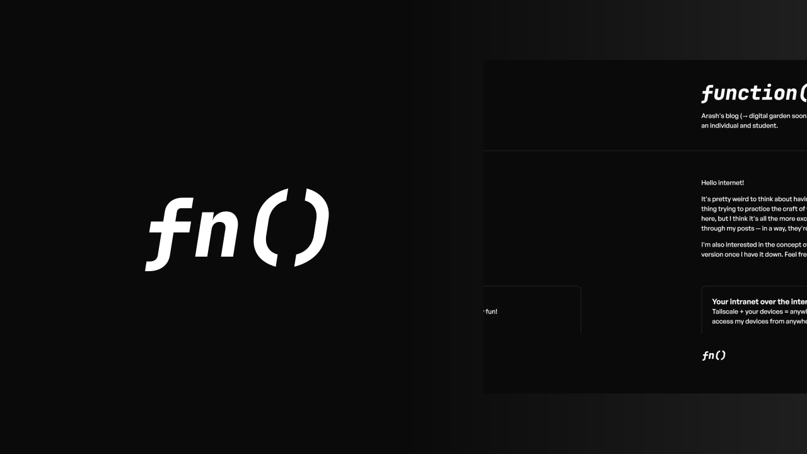

# function

Welcome to the repository of function(), my blog (accessible at https://blog.arash.codes)! function() primarily focuses on sharing code snippets I find useful, experiences that I have gone through, and stories that I wish to share with the world.

The source code features the following tech stack:

|          Technology          | Description of use                                                                                                         |
| :--------------------------: | :------------------------------------------------------------------------------------------------------------------------- |
| [Astro](https://astro.build) | The framework used to power the entire website. It allows you to easily create performant content-driven websites.         |
| [Vercel](https://vercel.com) | The platform used to deploy the website. It allows me to effortlessly publish live changes to the domain at a single push. |

## Motivations

For a while, I have visited the blogs of a few developers who shared interesting solutions to the problems they've faced that I had as well. I was impressed with how each blog was unique to its own self and the developer itself: content-wise, design-wise, and style-wise. In a way, blogs can be used to share more about an individual — not just a developer — through the way they write, design, and plan.

That inspired me to create a blog of my own. Not to mention, embarking on a project like this allowed me to expand my horizons with what I know and learn new things while enjoying the process of learning by doing.

## Contributing

This project is **_not_ accepting major contributions** as it is personal. However, if there is an issue — like a spelling or grammatical error, a visual bug, or other kinds of weird things happening — please feel free to [create an issue](https://github.com/arashnrim/blog/issues/new).

If you would like to leave comments about the source code — like possible design and code improvements, or other kinds of feedback — please feel free to [create an issue](https://github.com/arashnrim/blog/issues/new) too if you wish!

## Licence

This repository is made open-source with the [MIT License](https://github.com/arashnrim/blog/blob/main/LICENSE.md), meaning that you are allowed to modify and distribute the source code as well as use it for private and commercial use provided that the licence and copyright notices are retained. However, if you are cloning or forking this project, **I ask that you remove the `src/content` folder** — whatever written in that should rightfully belong to me. For more information, visit the link above to learn what is permitted by the licence.
